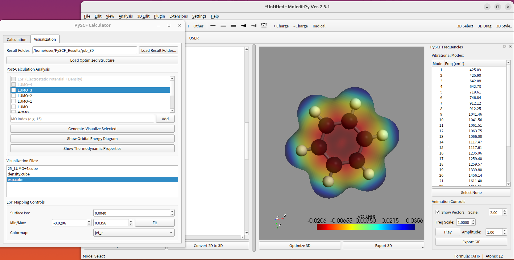

# PySCF Calculator Plugin

A powerful, user-friendly GUI interface for performing Quantum Chemistry calculations using PySCF. This plugin provides a seamless workflow for configuring calculations, managing jobs, and visualizing results, including a Interactive Orbital Energy Diagram.



## Features

### Calculation Capabilities
- **Job Types**: Single Point Energy, Geometry Optimization, Frequency Analysis.
- **Methods**: RHF, UHF, RKS, UKS (DFT).
- **Functionals**: Support for standard functionals (B3LYP, PBE, etc.) via PySCF.
- **Advanced Configuration**: Control over Basis Sets, Charge/Spin, Symmetry, Max Cycles, Convergence Tolerance, CPU Threads, and Memory.

### Visualization & Analysis
- **Interactive Orbital Energy Diagram**:
  - Automatically displays HOMO/LUMO energies and gaps.
  - **Zoom & Pan**: Scroll to zoom (default 3x gap view) and drag to pan; double-click to reset.
  - **Adaptive Labels**: Displays orbital names (HOMO-1, LUMO+2) and energies.
  - **Export**: Save diagrams as high-resolution PNG images.
- **Property Analysis**:
  - Generate standard .cube files for Molecular Orbitals (MOs).
  - Compute and visualize Electron Density and Electrostatic Potential (ESP).
  - Handles Open-Shell (UHF) density correctly.
- **Thermodynamic Properties**: Calculate and view Enthalpy, Entropy, Gibbs Free Energy, and ZPE from frequency jobs.

### Robust Job Management
- **Organized Output**: Each calculation automatically creates a unique directory (output/job_1, job_2...) to prevent data loss.
- **Full Logging**: Captures all PySCF output (including low-level C warnings) to both the GUI log window and pyscf.out log files.
- **Artifact Safety**: Inputs, Checkpoints, and Cube files are strictly contained within their specific job folder.

## Installation

### Requirements
```bash
pip install pyscf PyQt6 numpy geometric
```
> [!WARNING]
> PySCF installation may fail, so it may only work on Linux.

### Setup
1. Clone this repository.
2. Ensure the `pyscf_calculator` folder is placed within your application's plugin directory or accessible path.
3. Launch the main application to access the PySCF Calculator interface.

## Usage

1. **Setup Tab**: Load your molecule (XYZ format), select method/basis, and configure resources (Threads/Memory).
2. **Run**: Click "Run Calculation". The interface will switch to the Visualization tab upon completion.
3. **Visualize**:
   - Use the **Orbital Diagram** to inspect electronic structure.
   - Select specific orbitals (e.g., HOMO, LUMO) to generate Cube files.
   - Click "Show Properties" for thermodynamic data (after Frequency jobs).

## License

This project is licensed under the **GNU General Public License v3.0 (GPLv3)**. See the [LICENSE](LICENSE) file for details.

