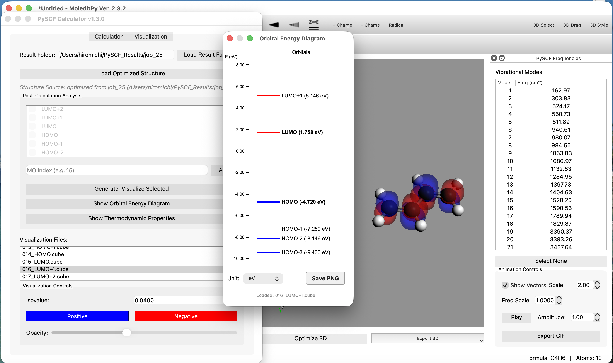
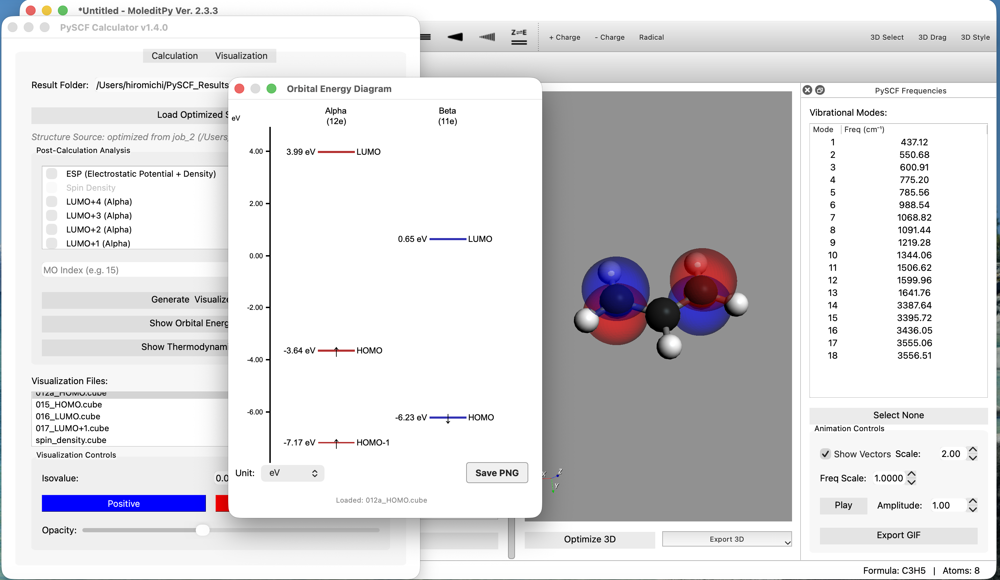

# MoleditPy PySCF Calculator Plugin

A powerful, user-friendly GUI interface for performing quantum chemistry calculations using PySCF. This plugin provides an intuitive workflow for configuring calculations, managing jobs, and visualizing molecular electronic structure.

**Excellent for learning molecular orbital theory, DFT calculations, and organic chemistry**: The interactive orbital energy diagram lets you click on any orbital (HOMO, LUMO, etc.) to instantly visualize its 3D shape and electron distribution. Easily switch between HF and DFT methods, compare different functionals (B3LYP, PBE, etc.), and explore various basis sets to understand the trade-offs between accuracy and computational cost. Beyond orbitals, visualize electrostatic potential (ESP) maps to understand reactive sites and intermolecular interactions, electron density to see bonding patterns, and spin density for radical species. These visual tools make abstract quantum chemistry concepts tangible and help students connect theory to real chemical behavior. Perfect for students exploring computational chemistry and researchers needing quick visual analysis.






## Features

### Calculation Capabilities
- **Job Types**: Single Point Energy, Geometry Optimization, Frequency Analysis.
- **Methods**: RHF, UHF, RKS, UKS (DFT).
- **Functionals**: Support for standard functionals (B3LYP, PBE, etc.) via PySCF.
- **Advanced Configuration**: Control over Basis Sets, Charge/Spin, Symmetry, Max Cycles, Convergence Tolerance, CPU Threads, and Memory.

### Visualization & Analysis
- **Interactive Orbital Energy Diagram**:
  - Automatically displays HOMO/LUMO energies and gaps.
  - **Interactive Loading**: Click on any orbital line (e.g., HOMO) to automatically load and visualize its Electron Density (Cube file).
  - **On-Demand Generation**: If a cube file is missing, clicking the orbital prompts you to generate it instantly without re-running the full job.
  - **Navigation**:
    - **Zoom**: Drag up/down to zoom in/out of energy levels.
    - **Pan**: Scroll (Touchpad compatible) to move the energy view up/down.
    - **Reset**: Double-click to restore the default view formatted to the HOMO-LUMO gap.
  - **Clean UI**:
    - Selectable units (eV / Hartree) with nice, round axis ticks.
    - "Save to PNG" feature that automatically hides UI controls for publication-quality figures.
- **Property Analysis**:
  - Generate standard .cube files for Molecular Orbitals (MOs).
  - Compute and visualize Electron Density, Spin Density, and Electrostatic Potential (ESP).
  - Handles Open-Shell (UHF) density correctly.
- **Thermodynamic Properties**: Calculate and view Enthalpy, Entropy, Gibbs Free Energy, and ZPE from frequency jobs.

### Robust Job Management
- **Organized Output**: Each calculation automatically creates a unique directory (output/job_1, job_2...) to prevent data loss.
- **Full Logging**: Captures all PySCF output (including low-level C warnings) to both the GUI log window and pyscf.out log files.
- **Artifact Safety**: Inputs, Checkpoints, and Cube files are strictly contained within their specific job folder.

## Installation

### Requirements
```bash
pip install pyscf PyQt6 numpy geometric
```
> [!WARNING]
> PySCF installation may fail on Windows, so it may only work on MacOS or Linux.

### Setup
1. **Download**: Download the plugin from the [Plugin Explorer](https://hiroyokoyama.github.io/moleditpy-plugins/explorer/?q=PySCF+Calculator).
2. **Install**: Unzip the downloaded file and place the `pyscf_calculator` folder into your application's `plugins` directory.
3. **Launch**: Start the main application, then navigate to the **Extensions** menu and select **PySCF Calculator**.

## Usage

1. **Setup Tab**: Load your molecule (XYZ format), select method/basis, and configure resources (Threads/Memory).
2. **Run**: Click "Run Calculation". The interface will switch to the Visualization tab upon completion.
3. **Visualize**:
   - Use the **Orbital Diagram** to inspect electronic structure.
   - Select specific orbitals (e.g., HOMO, LUMO) to generate Cube files.
   - Click "Show Properties" for thermodynamic data (after Frequency jobs).

## License

This project is licensed under the **GNU General Public License v3.0 (GPLv3)**. See the [LICENSE](LICENSE) file for details.


