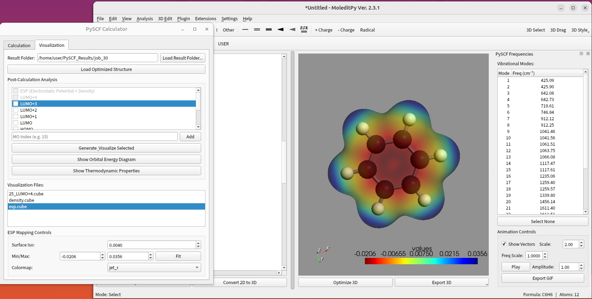
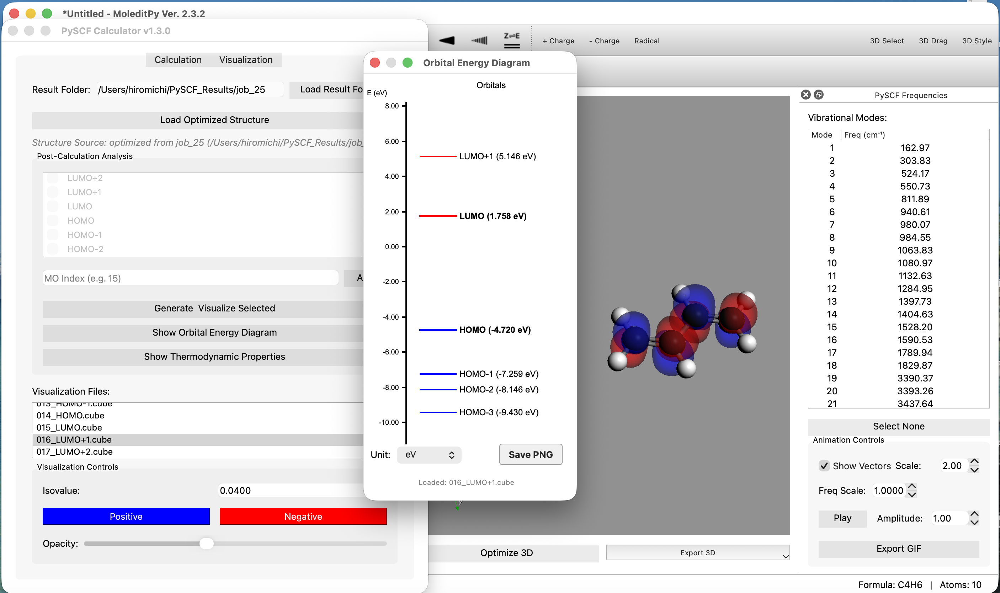
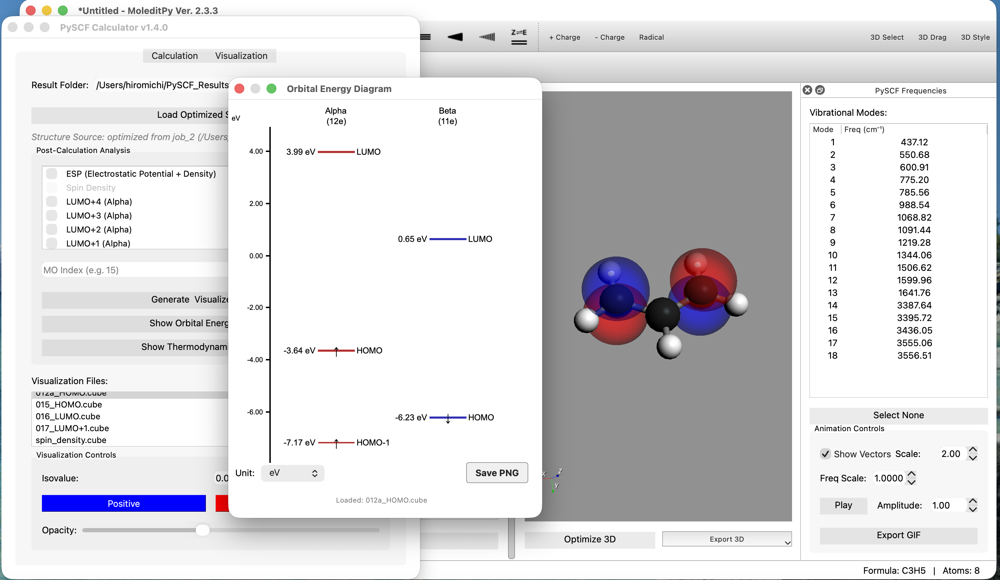
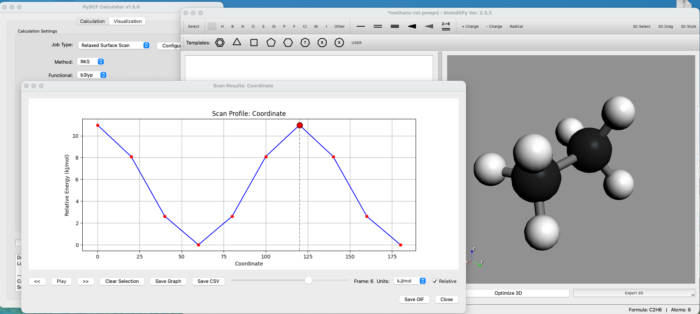

# MoleditPy PySCF Calculator Plugin

[](https://doi.org/10.5281/zenodo.18312165)
[](https://github.com/HiroYokoyama/moleditpy_pyscf-calculator/actions/workflows/pytest.yml)
[](https://github.com/HiroYokoyama/moleditpy_pyscf-calculator/actions/workflows/real-pyscf.yml)

[](https://github.com/HiroYokoyama/python_molecular_editor)
[](https://github.com/HiroYokoyama/moleditpy_pyscf-calculator/tags)
[](https://github.com/HiroYokoyama/moleditpy_pyscf-calculator/releases)

Repo: [https://github.com/HiroYokoyama/moleditpy_pyscf-calculator/](https://github.com/HiroYokoyama/moleditpy_pyscf-calculator/)

A powerful, user-friendly GUI interface for performing quantum chemistry calculations using PySCF. This plugin provides an intuitive workflow for configuring calculations, managing jobs, and visualizing molecular electronic structure.

**Research-Grade Power with Educational Clarity**: Transform abstract quantum mechanics into tangible, interactive discoveries. Built on the industrial-strength **PySCF** engine, this plugin delivers rigorous accuracy for researchers while offering an intuitive visual interface that makes it an indispensable platform for mastering **Physical Chemistry or Organic Chemistry**. Whether you are a researcher performing rapid conformational scans and transition state searches to screen candidates, or a student decoding the principles of molecular orbital theory, this tool bridges the gap between complex algorithms and chemical insight. From predicting reactivity with HOMO/LUMO visualizations to mapping detailed Potential Energy Surfaces, it empowers users at all levels to visualize, analyze, and understand the fundamental forces driving chemical change.

## Tutorial
Master quantum chemistry calculations in MoleditPy with step-by-step interactive guides. These tutorials demonstrate how to integrate structural modeling with electronic structure theory using PySCF.

**[Launch Interactive Tutorials](https://hiroyokoyama.github.io/moleditpy_pyscf-calculator/tutorial/index.html)**

## Gallery









## Features

### Calculation Capabilities
- **Job Types**: Single Point Energy, Geometry Optimization, Frequency Analysis, Optimization + Frequency, Transition State Optimization (+ Frequency), TDDFT, Rigid & Relaxed Surface Scans.
- **Methods**: RHF, UHF, ROHF, RKS, UKS, ROKS (open-shell RHF/RKS jobs switch to UHF/UKS automatically).
- **Functionals**: LDA, GGA, meta-GGA, hybrid and range-separated functionals via PySCF/libxc (B3LYP, PBE, PBE0, r2SCAN, M06-2X, ωB97X-V, ωB97M-V, CAM-B3LYP, ...).
- **Dispersion**: Grimme D3(BJ), D3(zero) or D4 (needs `pip install pyscf-dispersion`).
- **Solvation**: ddCOSMO implicit solvent (water, alcohols, acetone, THF, chloroform, DCM, toluene, benzene) for every job type.
- **Frequencies**: Analytic Hessian, or a numerical (finite-difference) Hessian for methods and solvent models without an analytic one; thermochemistry at a chosen temperature and pressure; the number of imaginary modes is checked against the job (none for a minimum, exactly one for a transition state).
- **Advanced Configuration**: Basis Set, Charge/Multiplicity, point-group Symmetry, broken-symmetry initial guess, DFT grid level, Max Cycles, Convergence Tolerance, CPU Threads, and Memory.
- **Settings Management**: Every option is saved with the project; save your preferred configuration as the default for future sessions.

### Visualization & Analysis
- **Interactive Orbital Energy Diagram**:
  - Automatically displays HOMO/LUMO energies and gaps.
  - **Interactive Loading**: Click on any orbital line (e.g., HOMO) to automatically load and visualize its Electron Density (Cube file).
  - **On-Demand Generation**: If a cube file is missing, clicking the orbital prompts you to generate it instantly without re-running the full job.
  - **Navigation**:
    - **Zoom**: Drag up/down to zoom in/out of energy levels.
    - **Pan**: Scroll (Touchpad compatible) to move the energy view up/down.
    - **Reset**: Double-click to restore the default view formatted to the HOMO-LUMO gap.
  - **Clean UI**:
    - Selectable units (eV / Hartree) with nice, round axis ticks.
    - "Save to PNG" feature that automatically hides UI controls for publication-quality figures.
- **Property Analysis**:
  - Generate standard .cube files for Molecular Orbitals (MOs).
  - Compute and visualize Electron Density, Spin Density, and Electrostatic Potential (ESP).
  - Handles Open-Shell (UHF) density correctly.
- **Thermodynamic Properties**: Calculate and view Enthalpy, Entropy, Gibbs Free Energy, and ZPE in a structured table format.
- **SCF Properties**: Dipole moment and Mulliken charges after every calculation (log and `properties.json`).
- **TDDFT**: Excitation energies, wavelengths and oscillator strengths in a table (TDHF for Hartree-Fock references).
- **Surface Scans**:
  - Configure Rigid or Relaxed scans over bond lengths, angles, or dihedrals.
  - Visualize potential energy surfaces with interactive plots and trajectory animations.
- **Transition State Analysis**:
  - Perform Transition State Optimizations (requires `geomeTRIC` library).
  - Visualize imaginary frequencies (saddle points) with animated vibrational modes.

### Robust Job Management
- **Organized Output**: Each calculation automatically creates a unique directory (output/job_1, job_2...) to prevent data loss.
- **Full Logging**: Everything a job reports -- PySCF's output, output from its C libraries, and the plugin's own summaries -- goes to both the GUI log window and the job's `pyscf.out`.
- **Reproducible Input**: Each job writes `pyscf_input.py`, a standalone script that reproduces its SCF.
- **Artifact Safety**: Inputs, Checkpoints, and Cube files are strictly contained within their specific job folder.

## Installation

### Requirements
- PySCF
- PyQt6
- NumPy
- GeomeTRIC
- Matplotlib
- Optional: `pyscf-dispersion` (D3/D4 corrections), `pyberny` (fallback optimizer)

```bash
pip install pyscf PyQt6 numpy geometric matplotlib
pip install pyscf-dispersion pyberny   # optional
```
> [!WARNING]
> Do not install `pyscf-dispersion` on Apple Silicon Macs: it has no arm64 wheel, and the
> version pip falls back to (1.0.0) makes `import pyscf` fail. The D3/D4 options then report
> that the package is missing; everything else works.
> [!WARNING]
> PySCF installation may fail on Windows, so it may only work on MacOS or Linux.

### Setup
1. **Download**: Download the plugin from the [Plugin Explorer](https://hiroyokoyama.github.io/moleditpy-plugins/explorer/?q=PySCF+Calculator).
2. **Install**: Unzip the downloaded file and place the `pyscf_calculator` folder into your application's `plugins` directory.
3. **Launch**: Start the main application, then navigate to the **Extensions** menu and select **PySCF Calculator**.

## Usage

1. **Setup Tab**: Load your molecule (XYZ format), select method/basis, and configure resources (Threads/Memory).
2. **Run**: Click "Run Calculation". The interface will switch to the Visualization tab upon completion.
3. **Visualize**:
   - Use the **Orbital Diagram** to inspect electronic structure.
   - Select specific orbitals (e.g., HOMO, LUMO) to generate Cube files.
   - Click "Show Properties" for thermodynamic data (after Frequency jobs).

## Testing

Two suites:

- `tests/` -- fast headless tests with PySCF, Qt and RDKit mocked (runs anywhere):
  ```bash
  python -m pytest tests/
  ```
- `tests_real/` -- the plugin driven against **real PySCF** (plus geomeTRIC, RDKit and
  offscreen PyQt6), each result checked against an independent PySCF reference: every
  calculation option on minimal molecules, the tutorials' results, the real GUI, and
  file logging. Modules skip themselves when a dependency is missing. PySCF has no
  native Windows build, so run it on Linux or macOS:
  ```bash
  pip install pyscf geometric pyberny pyscf-dispersion rdkit PyQt6 pyvista matplotlib pytest
  QT_QPA_PLATFORM=offscreen python -m pytest tests_real -m "not slow"   # ~2 min
  python -m pytest tests_real -m slow   # the full SN2 tutorial (~3 min)
  ```

## License & Disclaimer

This project is licensed under the GNU General Public License v3.0 (GPLv3) - see the [LICENSE](LICENSE) file for details. As open-source software, it is provided 'as is' without warranty of any kind, and the author assumes no responsibility or liability for the results. Although outputs have been carefully verified, users are strongly encouraged to independently check and validate them for critical applications (such as publications). If you encounter any bugs, please open an issue.
